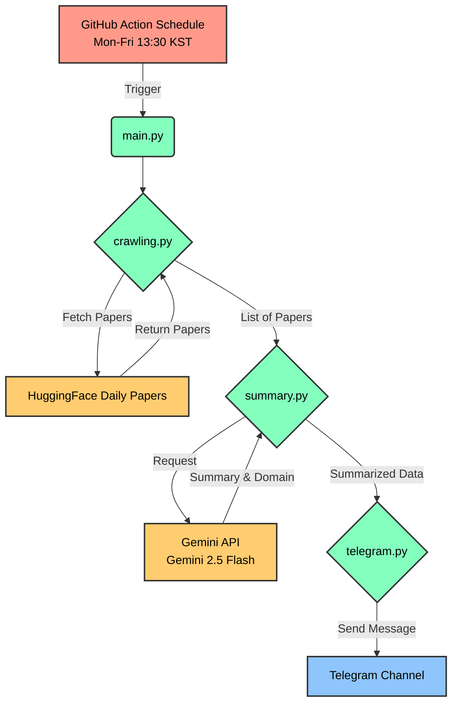

# Papers

### 💡 배경
HuggingFace에서 운영하는 Daily Paper에서는 매일 새로운 기술에 관련한 paper를 소개하지만,
10개 이상 paper의 모든 내용을 매일 확인하기에는 어려움  

### ✨ 서비스
그래서, Daily Paper의 초록(Abstract)을 **한 줄로 요약하고 한글로 번역해** 전달하는 서비스 
📅 **기간** : 평일 (월요일-금요일)  
⏰ **시간** : 한국 시간(KST) 기준 매일 오후 1시 30분경 (LLM 추론 속도 및 GitHub Actions의 처리 속도에 따라 지연될 수 있음) 

##### ⚙️ 주요 기능
- 논문 크롤링 자동화 : [HuggingFace Daily Paper](https://huggingface.co/papers) 에서 최신 논문 자동 수집
- 내용 요약 및 번역 : 논문 초록을 간결하고 자연스러운 한국어로 요약 및 번역
- 도메인 분류 : 논문의 주요 연구 분야를 자동 분류
- 텔레그램 알림 : 요약된 논문을 텔레그램으로 편리하게 제공
- 간편한 배포 및 관리 : GitHub Action의 스케줄링으로 별도의 서버 관리없이 자동 실행 

##### 🔄 전체 워크플로우

  

### 🛠️ 개발 스택
🐍**언어** : Python 3.9  
⏱️**스케줄링** : GitHub Action  
🚀**추론 라이브러리** : google-generativeai  
🤖**모델** : Gemini 2.5 Flash (요약, 번역, 도메인 분류 동시 수행)   
